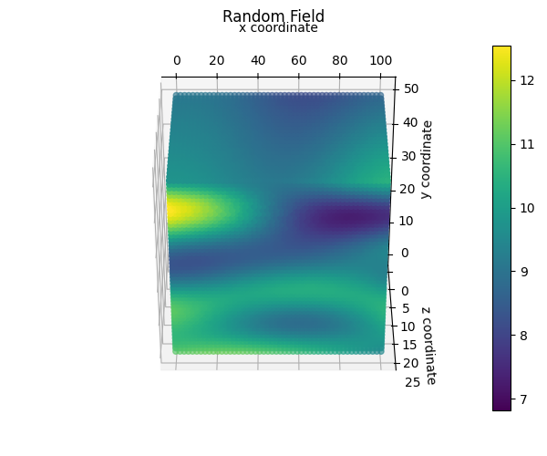

# RandomFields

[](https://codecov.io/gh/StemVibrations/RandomFields)

# Random Fields

Python package to generate random fields in 2D or 3D on unstructured grids.

## Background information
The random fields are generated using [gstools](https://geostat-framework.readthedocs.io/en/latest/).

Currently, the following covariance models are available:
- Gaussian
- Exponential
- Matern
- Linear

## Installation

To install the package, run the following command in the terminal:
```bash
pip install git+https://github.com/StemVibrations/RandomFields
```

# Tutorial
## Example in 2D

In this example we generate a random field on a 2D regular grid.

First you need to import the packages:

```python
import numpy as np
from random_fields.generate_field import RandomFields, ModelName
from random_fields.utils import plot2D
```

Then you need to define the grid:

```python
x = np.linspace(0, 100, 50)
y = np.linspace(0, 50, 50)

x, y = np.meshgrid(x, y)
```

In this example we create a mesh of 50x50 points between 0 and 100 in x and 0 and 50 in y direction.

Then we define the random field properties:

```python
nb_dimensions = 2
mean = 10
variance = 2
vertical_scale_fluctuation = 10
anisotropy = [1]
angle = [0]
model_rf = ModelName.Gaussian
```

In this example we use a Gaussian covariance model.

Then we create the random field:

```python
rf = RandomFields(model_rf, nb_dimensions, mean, variance, vertical_scale_fluctuation, anisotropy, angle, seed=14)
rf.generate(np.array([x.ravel(), y.ravel()]).T)
```

To visualise the results you can run:

```python
plot2D([np.array([x.ravel(), y.ravel()]).T], [rf.random_field], title="Random Field", output_folder="./", output_name="random_field.png")
```

The result is the following random field:


## Example in 3D

In this example we generate a random field on a 3D regular grid.

First you need to import the packages:

```python
import numpy as np
from random_fields.generate_field import RandomFields, ModelName
from random_fields.utils import plot3D
```

Then you need to define the grid:

```python
x = np.linspace(0, 100, 50)
y = np.linspace(0, 50, 50)
z = np.linspace(0, 25, 25)

x, y, z = np.meshgrid(x, y, z)
```
In this example we create a mesh of 50x50x25 points between 0 and 100 in x, 0 and 50 in y direction and 0 and 25 in z direction.

Then we define the random field properties:

```python
nb_dimensions = 3
mean = 10
variance = 2
vertical_scale_fluctuation = 10
anisotropy = [5, 5]
angle = [0, 0]
model_rf = ModelName.Gaussian
```

Then we create the random field:

```python
rf = RandomFields(model_rf, nb_dimensions, mean, variance, vertical_scale_fluctuation, anisotropy, angle, seed=14)
rf.generate(np.array([x.ravel(), y.ravel(), z.ravel()]).T)
```

To visualise the results you can run:

```python
plot3D([np.array([x.ravel(), y.ravel(), z.ravel()]).T], [rf.random_field], title="Random Field", output_folder="./", output_name="random_field_3D.png")

```
The result is the following random field:


