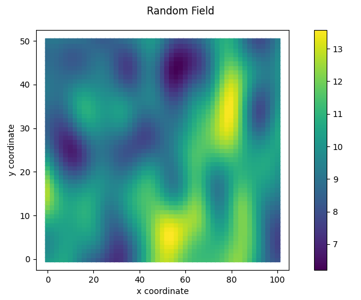
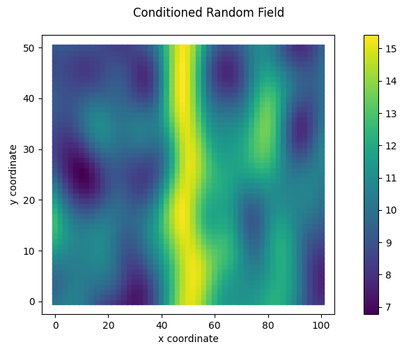
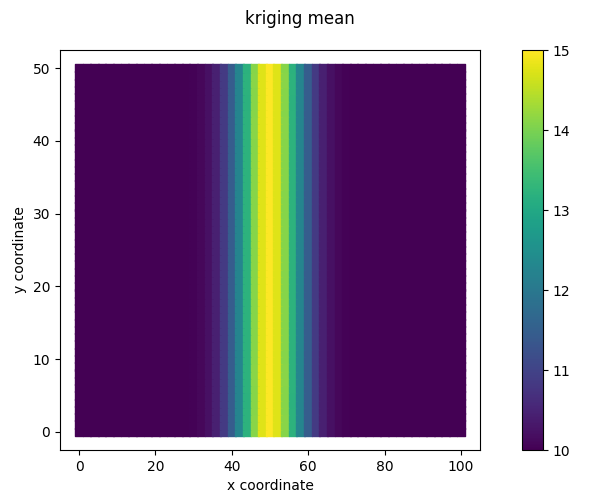
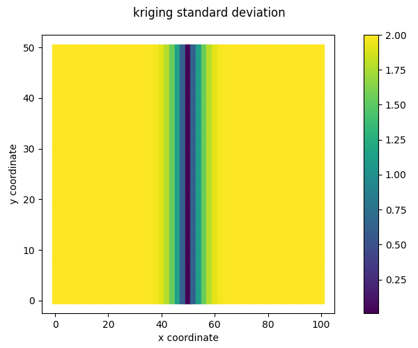

RandomFields tutorials
======================

.. _tutorial2:

2D Random Field
---------------

This tutorial shows step by step guide on how to set up the random field generator in 2D
and visualise the resulting random fields.

First the necessary packages are imported, the 2D grid is defined and the random field properties are set:

.. code-block:: python

    import numpy as np
    from random_fields.generate_field import RandomFields, ModelName
    from random_fields.utils import plot2D

    x = np.linspace(0, 100, 51)
    y = np.linspace(0, 50, 51)
    x, y = np.meshgrid(x, y)

    nb_dimensions = 2
    mean = 10
    variance = 2
    vertical_scale_fluctuation = 10
    anisotropy = [1]
    angle = [0]
    model_rf = ModelName.Gaussian

An unconditioned random field is constructed as:

.. code-block:: python

    rf = RandomFields(model_rf, nb_dimensions, mean, variance, vertical_scale_fluctuation, anisotropy, angle, seed=14)
    rf.generate(np.array([x.ravel(), y.ravel()]).T)

    plot2D([np.array([x.ravel(), y.ravel()]).T], [rf.random_field],
           title="Random Field",
           output_folder="./",
           output_name="random_field_4.png",
           show=True)

Conditioning is similar to :ref:`tutorial1`.
First we define the conditioning points and values, and then we generate the conditioned random field.
In this case we define a conditional random field where we know the points that are located at x=50 and all y values.
(with a value of 15).

.. code-block:: python

    xc = np.array([50.] * 51)
    yc = np.linspace(0, 50, 51)

    vc = np.array([15] * 51)

    rf.set_conditioning_points(np.array([xc,yc]).T, vc, noise_level=0.0001)
    rf.generate_conditioned(np.array([x.ravel(), y.ravel()]).T)

The 2D conditioned random field can be visualised as:

.. code-block:: python

    plot2D([np.array([x.ravel(), y.ravel()]).T], [rf.conditioned_random_field],
           title="Conditioned Random Field",
           output_folder="./",
           output_name="random_field_5.png",
           show=True)

The kriging mean and variance can be visualised as:

.. code-block:: python

    plot2D([np.array([x.ravel(), y.ravel()]).T], [rf.kriging_mean],
           title="kriging mean",
           output_folder="./",
           output_name="kriging_mean_2D.png",
           show=True)

    plot2D([np.array([x.ravel(), y.ravel()]).T], [rf.kriging_std],
           title="kriging std",
           output_folder="./",
           output_name="kriging_std_2D.png",
           show=True)

