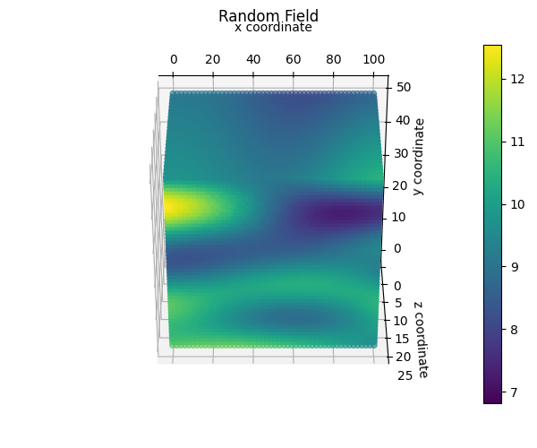
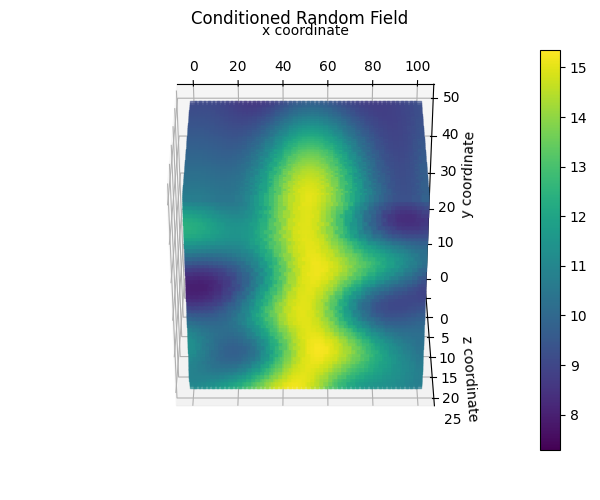
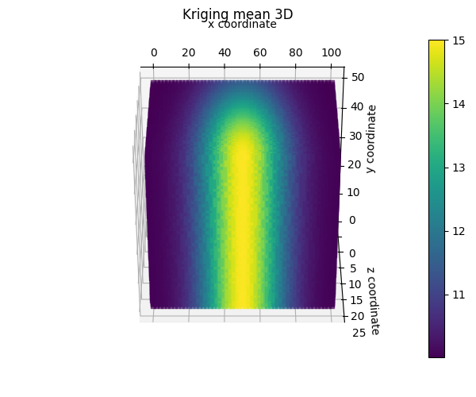
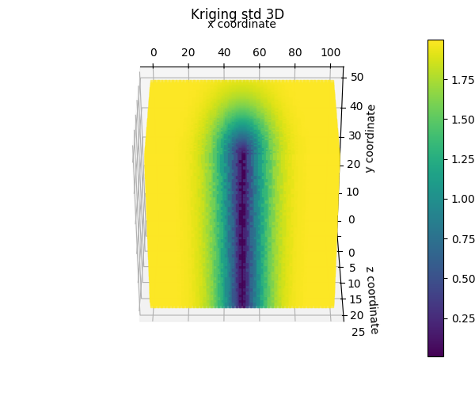

RandomFields tutorials
======================

.. _tutorial3:

Example in 3D
-------------

This tutorial shows step by step guide on how to set up the random field generator in 3D
and visualise the resulting random fields.

First the necessary packages are imported, the 3D grid is defined and the random field properties are set:

.. code-block:: python

    import numpy as np
    from random_fields.generate_field import RandomFields, ModelName
    from random_fields.utils import plot3D

    # mesh coordinates
    x = np.linspace(0, 100, 51)
    y = np.linspace(0, 50, 51)
    z = np.linspace(0, 25, 51)
    x, y, z = [i.ravel() for i in np.meshgrid(x, y, z)]

    # random field properties
    nb_dimensions = 3
    mean = 10
    variance = 2
    vertical_scale_fluctuation = 10
    anisotropy = [2.5, 2.5]
    angle = [0, 0]
    model_rf = ModelName.Gaussian

    # generate and plot random field
    rf = RandomFields(model_rf, nb_dimensions, mean, variance, vertical_scale_fluctuation,
                      anisotropy, angle, seed=14)
    rf.generate(np.array([x, y, z]).T)
    plot3D([np.array([x, y, z]).T], [rf.random_field],
           title="Random Field",
           output_folder="./",
           output_name="random_field_3D.png",
           show=True)

Conditioning is similar to :ref:`tutorial1`.
First we define the conditioning points and values, and then we generate the conditioned random field.
In this case we define a conditional random field where we know the points that are located at x=50 and z=25
and all y values (with a value of 15).

.. code-block:: python

    # declare conditioning points
    xc = np.array([50.] * 51)
    yc = np.linspace(0, 50, 51)
    zc = np.array([25] * 51)
    vc = np.array([15] * 51)
    rf.set_conditioning_points(np.array([xc, yc, zc]).T, vc, noise_level=0.0001)

    # generate conditioned random field model
    rf.generate_conditioned(np.array([x, y, z]).T)

To visualise the results we can plot the conditioned random field, kriging mean and kriging standard deviation:

.. code-block:: python

    plot3D([np.array([x, y, z]).T], [rf.conditioned_random_field],
           title="Conditioned Random Field",
           output_folder="./",
           output_name="conditioned_random_field_3D.png")

    plot3D([np.array([x, y, z]).T], [rf.kriging_mean],
           title="Kriging mean 3D",
           output_folder="./",
           output_name="kriging_mean_3D.png")

    plot3D([np.array([x, y, z]).T], [rf.kriging_std],
           title="Kriging std 3D",
           output_folder="./",
           output_name="kriging_std_3D.png")

