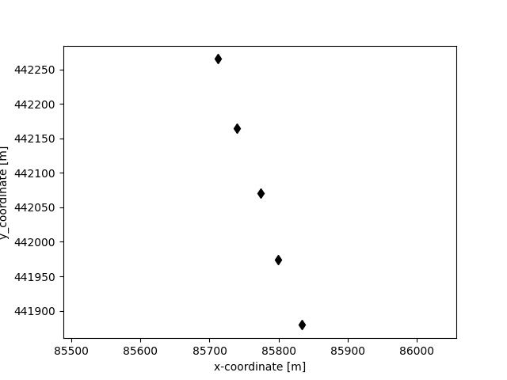
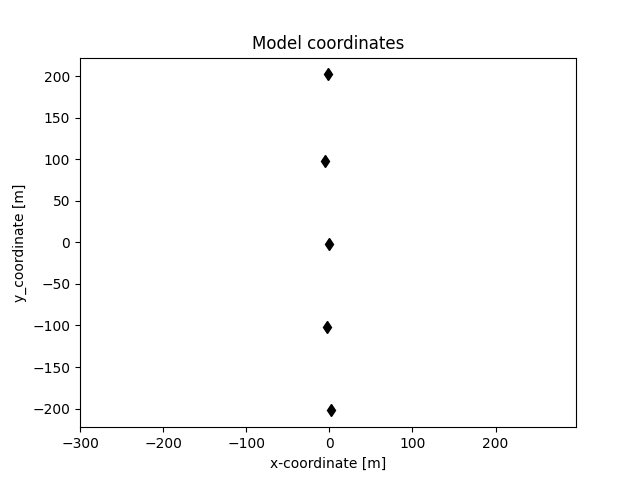
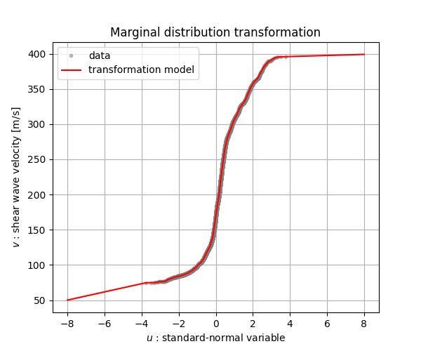
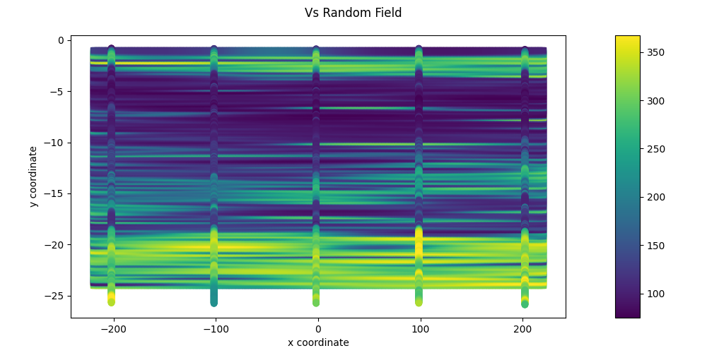
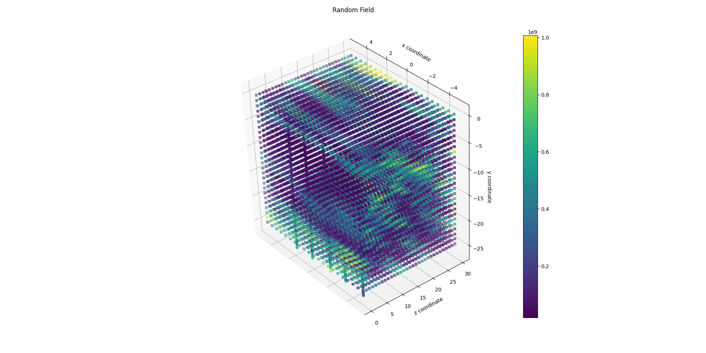

RandomFields tutorials
======================

.. _tutorial4:

2D and 3D conditioned Random Field on CPT data
----------------------------------------------
This tutorial shows how a subsurface model can be created directly from CPT data.
First, the concept of the CPT-based random field generation for subsurface models is presented.
Second, the implementation of the CPT-based random field generation is described.

Theory
......

The processing of the CPT data is based on the following steps:
* CPT data is read and interpreted into a set of point with coordinates `(x, y, z)` and corresponding interpreted
  properties $z_{data}$ (e.g. shear wave velocity `vs` based on  tip resistance and sleeve friction).
  The the distribution of the dataset $x_{data}$ is considered to be representative for the distribution
  of the site $x\inX$.
* A transfomration model is created based on the CPT data.
  This transfomration model $X=T(Z)$ characterises the distribution of the physical stochastic parameter $X$
  as a function of the standard-normal stochastic variable $Z \\sim N(0,1)$.
  This model is used to create the standard-normal equivalent data $z_{data} = T^{-1}(x_{data})$
* The standard-normal data is used to calibrate a Gaussian regression model.
  Sampling from this model provides the conditioned.
  Internally, the sampoling is performed in the traditional Kriging formulation,
  in which an unconditioned random field is conditioned to the conditioning data.
  This takes place in the standard-normal space, resultin gin standar-normal fields $u_{field}$.
* The generated conditioned random fields are transformed to the parameter space using the
  transformation model: $v_{field} = T(u_{field})$.

Example
.......
In this example a 2D cross section is created with Random Fields conditioned on CPT data.

First the necessary packages are imported, and the seed number is fixed for reproducibility.:

.. code-block:: python

    from pathlib import Path
    import matplotlib.pyplot as plt
    import numpy as np
    from random_fields.geostatistical_cpt_interpretation import CPT_data, MarginalTransformation, GeostatisticalModel
    from random_fields.generate_field import RandomFields, ModelName
    from random_fields.utils import plot2D

    seed = 14
    np.random.seed(seed)

The CPT data is read and interpreted. The interpretation of the CPT data is based on
`Geolib-Plus <https://deltares.github.io/GEOLib-Plus>`_
The CPT data is read from a folder containing the CPT files. The CPT data can be in 'gef' or 'xml' format.
The CPTs used on this example are in 'gef' format, and can be found
`here <https://github.com/StemVibrations/RandomFields/tree/main/tests/cpts/gef>`_.

.. code-block:: python

    path_cpts = "./cpt_data"
    cpt_folder = Path(path_cpts)
    cpt_data = CPT_data(cpt_directory=cpt_folder)
    cpt_data.read_cpt_data()
    cpt_data.interpret_cpt_data()

The location of the CPTs can be visualised and its coordinated can be changed/rotated using the following code:

.. code-block:: python

    # visualise
    plt.title('Original coordinates')
    cpt_data.plot_coordinates(show=True)

    # transform the data to a modelling domain
    cpt_data.data_coordinate_change(orientation_x_axis=73, based_on_midpoint=True)

    plt.title('Model coordinates')
    cpt_data.plot_coordinates(show=True)

To create the transformation model, the marginal transformation is created.
The marginal transformation model can be generated and visualised as follows:

.. code-block:: python

    marginal_transformator = MarginalTransformation(cpt_data.vs, min_value=50)
    marginal_transformator.plot(x_label='$u$ : standard-normal variable', y_label='$v$ : shear wave velocity [m/s]',
                                show=True)

Next, the data for the calibration of the geostatistical model can be selected.
To allow a faster calibration of the geostatistical model, only a selection of the data is used.
This selection of 2000 pooints is made randomly.
The data is transformed to standard-normal data using the transformator and only the `z` (horizontal)
and `y` (vertical) coordinates are selected.
Calibration is based on likelihood maximisation.

.. code-block:: python

    index_selection = np.random.choice(len(cpt_data.vs), size=2000, replace=False)
    coords = cpt_data.data_coords[index_selection]
    z_data = marginal_transformator.x_to_z(x=cpt_data.vs[index_selection])

    geo_model = GeostatisticalModel(nb_dimensions=2, v_dim=1)
    geo_model.calibrate(coords=coords[:, [2, 1]], values=z_data)

Next, the random field properties are transferred to the random field generator.
This generator needs to be initiated with the same spatial correlation model as used for the calibration
(default=Gaussian). In addition, conditioning points are required to generate meaningful conditioned random fields.
These points can, but don't need to be, the same points as used for the calibration.
Also, conditional simulation can account for the noise in the calibration and conditioning data.
This noise is not included in the field itself, but instead allows for a small deviation of the generated random fields
from the conditioning points:

.. code-block:: python

    random_field_generator = RandomFields(model_name=ModelName.Gaussian,
                                        n_dim=2,
                                        mean=0,
                                        variance=1,
                                        v_scale_fluctuation=geo_model.vertical_scale_fluctuation,
                                        anisotropy=geo_model.anisotropy,
                                        angle=[0],
                                        seed=seed)

    I = np.random.choice(len(cpt_data.vs), size=500, replace=False)

    coords = cpt_data.data_coords[I]
    values = cpt_data.vs[I]
    random_field_generator.set_conditioning_points(points=coords[:, [2, 1]],
                                                values=marginal_transformator.x_to_z(x=values),
                                                noise_level=geo_model.noise_level)

To generate the Random Field a coordinate grid needs to be specified.

.. code-block:: python

    # create grid of points on the domnain (-220, 220) by (-24, -1)
    x = np.linspace(-220, 220, 250)
    z = np.linspace(-24, -1, 250)
    X,Z = np.meshgrid(x, z)

    # generate a conditioned random field
    sample_coords = np.array([X.ravel(), Z.ravel()]).T
    random_field_generator.generate_conditioned(nodes=sample_coords)

The conditioned random field that is generated contains values at the prediction points (the regular grid) as well
as on the conditioning point coordinates. In the generated array, the values generated at the conditioning point
coordinates are at the end. They are generally not needed as part of the generated random field and can be left out.
The generated standard-normal field needs to be transformed to the marginal distribution of the physical variable
(in this case the shear wave velocity) by the marginal transformation.

.. code-block:: python

    # Transform the generated standard-normal field to the distribution of the shear wave velocity
    z_map = random_field_generator.conditioned_random_field
    vs_map = marginal_transformator.z_to_x(z_map[:250 * 250].reshape([250, 250]))

    plot2D([np.array([X.ravel(), Z.ravel()]).T], [vs_map],
           title="Vs Random Field",
           output_folder="./",
           output_name="vs.png",
           conditional_points=[cpt_data.data_coords[:, [2, 1]], cpt_data.vs],
           figsize=(10, 5),
           show=True)

This results in a 2D cross section of the generated random field, on the shear wave velocity,
conditioned on the CPT data.

3D conditioned Random Field on CPT data with helper function
------------------------------------------------------------
In Randomn Fields it is possible to create the conditional random field in 3D, by making use of a helper function.
The helper function creates random fields with the Gaussian model, and for two properties: Young modulus and
Solid density of the soil.

The helper function is called `ElasticityFieldsFromCpt` and is part of
the `random_fields.geostatistical_cpt_interpretation` class.

First we import all the necessary packages:

.. code-block:: python
    import numpy as np
    from random_fields.geostatistical_cpt_interpretation import ElasticityFieldsFromCpt, RandomFieldProperties
    from random_fields.utils import plot3D

Then we create the ElasticityFieldsFromCpt object. The `orientation_x_axis` is the angle of the x-axis in the model,
the `porosity` is the porosity of the soil, and the `water_density` is the density of the water.
The `return_property` is a list of the properties that we want to generate. In this case we want to generate the
random field for the Young modulus.

.. code-block:: python

    elastic_field_generator_cpt = ElasticityFieldsFromCpt(cpt_file_folder=cpt_folder,
                based_on_midpoint = True,
                max_conditioning_points = 1000,
                orientation_x_axis = 72,
                porosity = 0.3,
                water_density = 1000,
                return_property = [RandomFieldProperties.YOUNG_MODULUS],
                )

    elastic_field_generator_cpt.calibrate_geostat_model()

Now we create a list of the points where we want to generate the random field. In this case we generate a 3D grid.
This grid is typically the mesh of a finite element calculation.

.. code-block:: python

    x = np.linspace(-5, 5, 21)
    y = np.linspace(-25, 0, 26)
    z = np.linspace(0, 30, 31)
    X, Y, Z = np.meshgrid(x, y, z)

    elastic_field_generator_cpt.generate(np.array([X.ravel(), Y.ravel(), Z.ravel()]).T)

To visualise the results we can make use of the `plot3D` function.

.. code=block:: python
    
    plot3D([np.array([X.ravel(), Y.ravel(), Z.ravel()]).T], [elastic_field_generator_cpt.generated_field[0]],
        title="Random Field",
        output_folder="./",
        output_name="random_field_3D.png",
        figsize=(10, 10),
        conditional_points=[elastic_field_generator_cpt.coordinates_sampled_conditioning,
                            elastic_field_generator_cpt.conditioning_sampled_data[0]],
        show=True)

