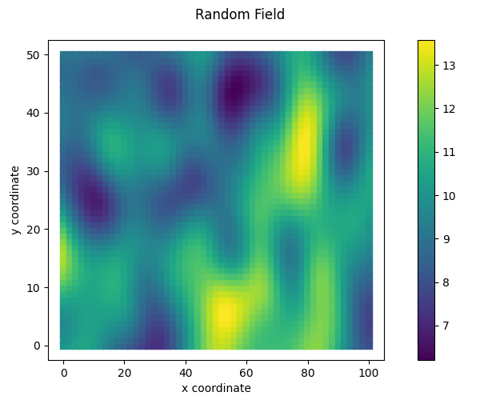
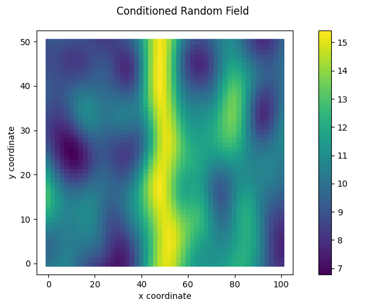
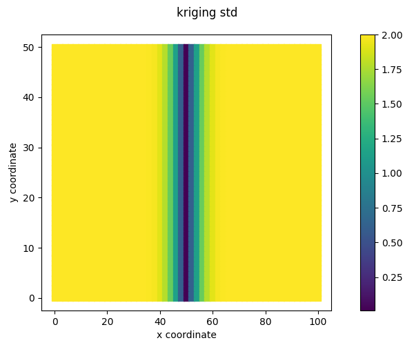
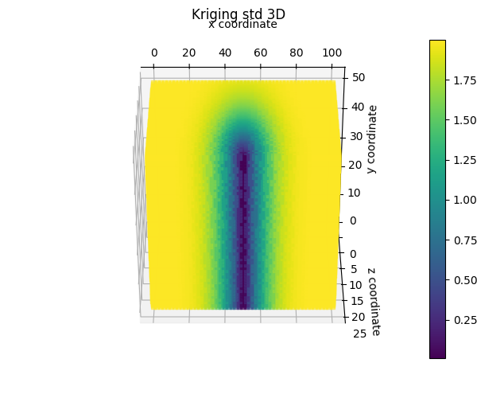

RandomFields tutorials
======================

.. _tutorial1:

Example in 1D
-------------
This tutorial shows step by step guide on how to set up the random field generator and visualise the resulting random fields.

First the necessary packages are imported and paths are defined.

.. code-block:: python

    import numpy as np
    from random_fields.generate_field import RandomFields, ModelName
    from random_fields.utils import plot2D

Then, you need to define the 1D grid:

.. code-block:: python

    x = np.linspace(0, 100, 501).reshape(-1,1)

In this example, we create a random field over a line of length 100, divided into steps of 0.2

Then we define the random field properties:

.. code-block:: python

    nb_dimensions = 1
    mean = 10
    variance = 2
    vertical_scale_fluctuation = 10
    anisotropy = []
    angle = []
    model_rf = ModelName.Gaussian

In this example, we use a a Gaussian covariance model.

Then we create the random field, in which the index of the 'vertical' dimension needs to be set to `0`:

.. code-block:: python

    rf = RandomFields(model_rf, nb_dimensions, mean, variance, 
                            vertical_scale_fluctuation, anisotropy, angle, seed=1)
    rf.v_dim = 0
    rf.generate(x.reshape(-1,1))

To visualise the results, you can run:

.. code-block:: python

    plot1D([x],[rf.random_field],
                    title = 'Random Field', 
                    output_folder="./", 
                    output_name="random_field_1.png")

Conditioning data can be added to the random field. The noise level represents the uncertainty in the individual conditioning points and is formulated as the normalised variance: the variance of the uncertainty in a single data point divided by the variance of the random field. ``noise_level`` can be a scalar, or an array of the same dimensions as ``conditioning _values``. 

.. code-block:: python

    conditioning_points = np.array([[30,50,70]]).T
    conditioning_values = np.array([-2.5,0,2.5])

    rf.set_conditioning_points(conditioning_points,conditioning_values, noise_level = 0.04)

Ten conditional random fields can be sampled and visualised as follows:

.. code-block:: python

    for i in range(10):
        rf.seed = i
        rf.generate_conditioned(x)
        rf_conditioned[i] = rf.conditioned_random_field

    plot1D([x]*10,rf_conditioned,
                        title = 'Conditioned Random Field', 
                        output_folder="./", 
                        output_name="random_field_2.png")    
    

As a by-product of the conditioned random field generator, the kriging mean and variance are provided:

.. code-block:: python

    mean = rf.kriging_mean
    std = rf.kriging_std

    plt.scatter(conditioning_points, conditioning_values, label = 'conditioning points')
    plt.plot(x, mean, label = 'kriged field')
    plt.fill_between(x.ravel(), mean - 1.65*std, mean + 1.65*std, label = '90% uncertainty bound')

Note that only simple kriging is applied for conditioning the random fields. See :ref:`theory` for more details.   

.. _tutorial2:

Example in 2D
-------------

A (conditioned) 2D random field is constructed as follows:

.. code-block:: python

    import numpy as np
    from random_fields.generate_field import RandomFields, ModelName
    from random_fields.utils import plot2D

    x = np.linspace(0, 100, 51)
    y = np.linspace(0, 50, 51)
    x, y = np.meshgrid(x, y)

    nb_dimensions = 2
    mean = 10
    variance = 2
    vertical_scale_fluctuation = 10
    anisotropy = [1]
    angle = [0]
    model_rf = ModelName.Gaussian

An unconditioned random field is constructed as:

.. code-block:: python

    rf = RandomFields(model_rf, nb_dimensions, mean, variance, vertical_scale_fluctuation, anisotropy, angle, seed=14)
    rf.generate(np.array([x.ravel(), y.ravel()]).T)

    plot2D([np.array([x.ravel(), y.ravel()]).T], [rf.random_field], title="Random Field", output_folder="./", output_name="random_field_4.png")

Conditioning is consistent with the 1D example:

.. code-block:: python

    xc = np.array([50.]*51)
    yc = np.linspace(0,50,51)

    vc = np.array([15]*51)

    rf.set_conditioning_points(np.array([xc,yc]).T,vc,noise_level = 0.0001)
    rf.generate_conditioned(np.array([x.ravel(), y.ravel()]).T)

    plot2D([np.array([x.ravel(), y.ravel()]).T], [rf.conditioned_random_field], 
                        title="Conditioned Random Field", 
                        output_folder="./", 
                        output_name="random_field_5.png")

The kriging mean and variance can be visualised as:

.. code-block:: python

    plot2D([np.array([x.ravel(), y.ravel()]).T], [rf.kriging_mean], 
                        title="kriging mean", 
                        output_folder="./", 
                        output_name="kriging_mean_2D.png")

    plot2D([np.array([x.ravel(), y.ravel()]).T], [rf.kriging_std], 
                        title="kriging std", 
                        output_folder="./", 
                        output_name="kriging_std_2D.png")

.. image:: _static/kriging_mean_2D.png 
    :width: 49%

In the same way, a 3D conditional random field can be created:

.. code-block:: python

    # mesh coordinates
    x = np.linspace(0, 100, 51)
    y = np.linspace(0, 50, 51)
    z = np.linspace(0, 25, 51)
    x, y, z = [i.ravel() for i in np.meshgrid(x, y, z)]

    # random field properties
    nb_dimensions = 3
    mean = 10
    variance = 2
    vertical_scale_fluctuation = 10
    anisotropy = [2.5, 2.5]
    angle = [0, 0]
    model_rf = ModelName.Gaussian

    # generate and plot random field
    rf = RandomFields(model_rf, nb_dimensions, mean, variance, vertical_scale_fluctuation, 
                            anisotropy, angle, seed=14)
    rf.generate(np.array([x, y, z]).T)
    plot3D([np.array([x, y, z]).T], [rf.random_field], 
                            title="Random Field", 
                            output_folder="./", 
                            output_name="random_field_3D.png")

    # declae conditioning points
    xc = np.array([50.]*51)
    yc = np.linspace(0,50,51)
    zc = np.array([25]*51)
    vc = np.array([15]*51)
    rf.set_conditioning_points(np.array([xc,yc,zc]).T,vc,noise_level = 0.0001)

    # generate and plot conditioned random field model
    rf.generate_conditioned(np.array([x, y,z]).T)
    plot3D([np.array([x, y, z]).T], [rf.conditioned_random_field], 
                            title="Conditioned Random Field", 
                            output_folder="./", 
                            output_name="conditioned_random_field_3D.png")
    plot3D([np.array([x, y, z]).T], [rf.kriging_mean], 
                            title="Kriging mean 3D", 
                            output_folder="./", 
                            output_name="kriging_mean_3D.png")
    plot3D([np.array([x, y, z]).T], [rf.kriging_std], 
                            title="Kriging std 3D", 
                            output_folder="./", 
                            output_name="kriging_std_3D.png")

.. image:: _static/conditioned_random_field_3D.png 
    :width: 49%
.. image:: _static/kriging_mean_3D.png 
    :width: 49%

.. _tutorial3:

Tutorial RandomFields in STEM
-----------------------------

TODO